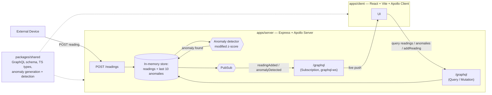

# Greenhouse Monitoring (fullstack-typescript-iot)

A small full-stack TypeScript monorepo for ingesting and viewing greenhouse
sensor readings in real time: external devices post readings over plain
REST, the server broadcasts them over a GraphQL subscription, and the React
client updates live.

## Architecture



## Tech stack

- **Bun workspaces** — monorepo tooling, package manager, runtime for the server
- **Apollo Server** (Express integration) — GraphQL API
- **graphql-ws** — GraphQL subscriptions over WebSocket
- **React + Vite** — client app
- **Apollo Client** — GraphQL queries/mutations/subscriptions in the browser
- **TypeScript** everywhere, **ESLint** (`typescript-eslint`) for linting

## Project structure

```
apps/
  server/       @iot/server       — Apollo Server + REST ingest endpoint
  client/       @iot/client       — React + Vite + Apollo Client
  mock-device/  @iot/mock-device  — dev-only fake sensor pushing readings
packages/
  shared/   @iot/shared  — GraphQL schema, shared TS types, anomaly
            generation rules + detection algorithm
api.http    — sample requests (GraphQL + REST)
```

## Setup

Requires [Bun](https://bun.com) installed locally.

```bash
bun install
```

## Running the dev servers

```bash
bun run dev          # server (:4000) + client (:5173) + mock device together
bun run dev:server   # server only
bun run dev:client   # client only
bun run dev:mock     # mock device only
```

Once running:
- GraphQL HTTP endpoint: `http://localhost:4000/graphql`
- GraphQL subscriptions (WebSocket): `ws://localhost:4000/graphql`
- REST ingest endpoint for devices: `http://localhost:4000/readings`
- Client: `http://localhost:5173`

### Mock device (dev only)

`apps/mock-device` simulates a real greenhouse sensor: every 3 seconds it
posts one reading (`temp`, `humidity`, `soilMoisture`, `co2`) to
`POST /readings`. Each value normally drifts 1-2% from its own previous
value; every 6th reading injects an anomaly — one randomly chosen metric
jumps by >10% — and the following reading resumes normally from the last
non-anomalous value. The ranges and thresholds it generates against live in
`@iot/shared` (see below), so generation and detection can never drift out
of sync. It's only meant for local development — already included in
`bun run dev`, or run it alone with `bun run dev:mock`. Point it at a
different server with `MOCK_TARGET_URL=http://localhost:4000/readings`.

### Anomaly detection

`@iot/shared`'s `anomaly/` module is the single source of truth for both
sides of anomaly handling:
- `generation.ts` — the per-metric operating ranges and deviation
  percentages the mock device generates against.
- `detection.ts` — a **modified (robust) z-score** detector: each incoming
  value is scored against the median and median absolute deviation (MAD) of
  its own trailing window (last 20 readings, min. 5 before it'll score
  anything), rather than mean/standard deviation. Mean and stdDev are
  themselves dragged toward outliers, which blunts a classic z-score's
  ability to catch the very spikes it's meant to find; median/MAD stay
  stable in their presence. A `|z| ≥ 3.5` flags a reading as anomalous.

Detection runs **server-side**: every reading, whether it arrives via
`POST /readings` or the `addReading` mutation, is scored in `store.ts`
against the trailing history before it. Anomalies are kept as an in-memory
log of the last 10 (`Query.anomalies`) and pushed live over a second
subscription, `Subscription.anomalyDetected`.

The client just reflects that feed (`useAnomalies` hook — query + subscribe,
no detection logic of its own): the metric card for the affected reading
shows its value in red (nothing else changes on the card), and the
Anomalies panel lists each one with a metric-specific icon
([lucide-react](https://lucide.dev)), its value, and its z-score — no red
in the list itself, just the icon-labeled rows.

Other useful scripts (run from the repo root, fan out to every workspace):

```bash
bun run typecheck
bun run lint
bun run lint:fix
bun run build
```

## Trying it out

The server starts with no readings — post some data first, then watch it
appear live in the client.

### Option A: the `api.http` file

Open [`api.http`](./api.http) with the [REST Client](https://marketplace.visualstudio.com/items?itemName=humao.rest-client)
VS Code extension and click "Send Request" above any block. It includes:
- a GraphQL query to fetch readings
- a GraphQL mutation to add a reading
- REST `POST /readings` examples, each posting a full reading (temp, humidity, soilMoisture, co2)
- an invalid payload example that should 400

### Option B: curl

```bash
curl -X POST http://localhost:4000/readings \
  -H 'Content-Type: application/json' \
  -d '{"temp": 23.6, "humidity": 55, "soilMoisture": 38.4, "co2": 798}'
```

### Option C: any GraphQL client

Point a tool like Insomnia, Altair, or Apollo Sandbox at
`http://localhost:4000/graphql` (queries/mutations) and
`ws://localhost:4000/graphql` (subscriptions) — there's no built-in GraphQL
Playground UI on this server, since it's mounted via `expressMiddleware`
without a landing page plugin.

With the client open in a browser, any reading posted through the endpoints
above shows up immediately via the `readingAdded` subscription.
