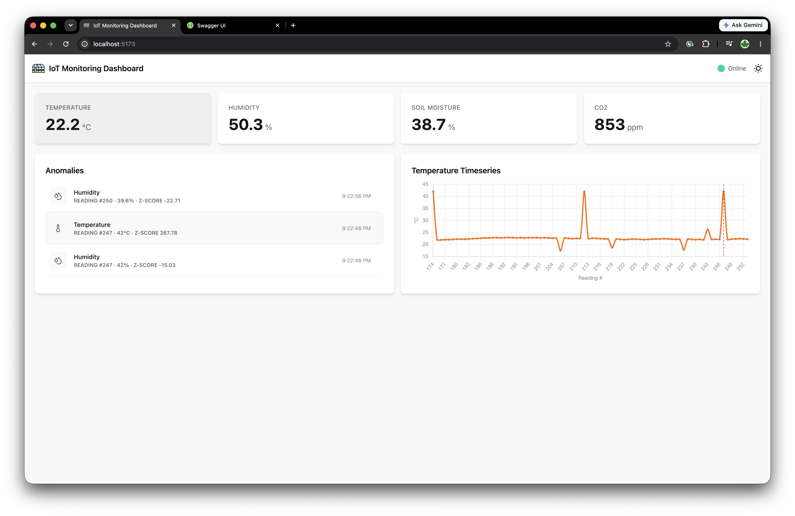
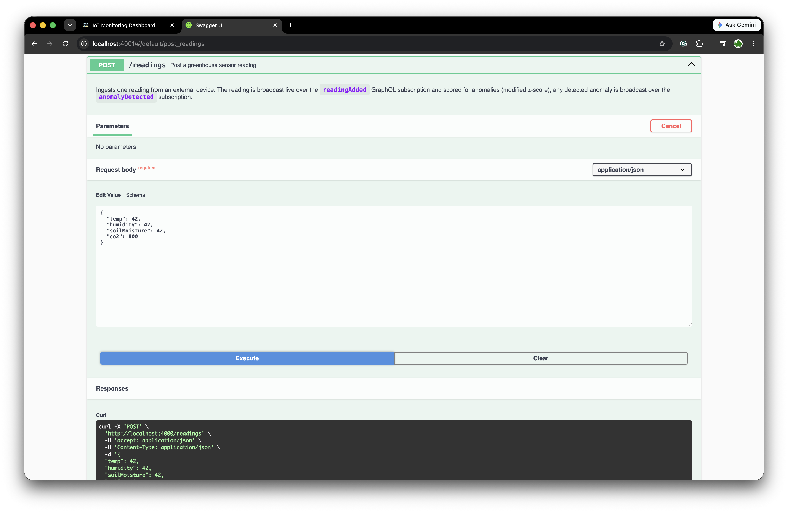
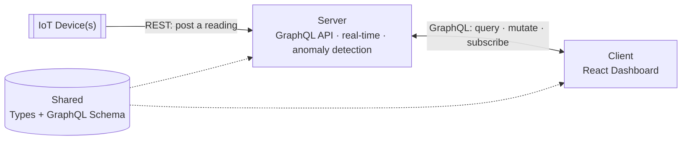

# IoT Monitoring Platform - a TypeScript + Bun

This is a proof of concept: small in scope on purpose, but built on
principles meant to carry straight over into a real product, not thrown
away once the idea is proven. Its purpose is to show how far a **single
language and a single toolchain - TypeScript, running on Bun end to end -
can carry a full-stack, real-time IoT monitoring application**: one shared
type system for the whole stack, no code-generation step, no build-tool
zoo. The scenario is concrete (a greenhouse: temperature, humidity, soil
moisture, CO2) but nothing about the architecture is specific to
greenhouses - swap the sensors and the schema and the same shape holds.

What it's meant to demonstrate:

- **One shared source of truth, zero drift.** The GraphQL schema, the domain
  types, and even the anomaly-detection math live once, in
  `packages/shared`, and are imported unmodified by the server, the React
  client, and the device simulator. Rename a field and every consumer fails
  to typecheck immediately - not at runtime, in production.
- **Real-time without extra infrastructure.** GraphQL subscriptions over a
  plain WebSocket push every new reading and every detected anomaly to the
  UI the instant they happen - no polling, no separate message broker.
- **Basic analysis today, built to grow.** A small statistical anomaly
  detector (a modified z-score) runs server-side out of the box. It lives in
  the same shared module where trend detection, forecasting, or alerting
  rules would go next - the point is the slot exists, not that this one
  algorithm is the final word.
- **Bun as the entire toolchain.** One package manager, one workspace
  runner, and the server runs its TypeScript directly with no separate
  build/transpile step; Vite does the equivalent job for the client bundle.

What it deliberately leaves out, because a PoC doesn't need it yet: a real
database (everything is in-memory), auth, multi-tenant device fleets. None
of that changes the architecture below - it scales by adding to it, not by
replacing it.

## Screenshots

**Dashboard** - live metric cards, detected anomalies, and a per-metric
timeseries chart:



**Swagger UI** - interactive docs for the `POST /readings` ingest endpoint:



## Architecture



Devices push readings in over plain REST; the server validates, stores, and
scores each one for anomalies, then serves everything back to the client
over one GraphQL API - reads, writes, and live subscriptions alike. Both
ends of that API are built from the same shared schema and types, so they
can't silently drift apart. (The fuller picture - the in-memory store, the
detector, the pub/sub fan-out to subscriptions - is in
[Anomaly detection](#anomaly-detection) below.)

## Tech stack

- **Bun workspaces** - monorepo tooling, package manager, runtime for the server
- **Apollo Server** (Express integration) - GraphQL API
- **graphql-ws** - GraphQL subscriptions over WebSocket
- **React + Vite + DaisyUI + Chart.js** - client app
- **Apollo Client** - GraphQL queries/mutations/subscriptions in the browser
- **swagger-ui-express** - interactive OpenAPI docs for the REST ingest endpoint
- **Docker** (multi-stage builds) + **GitHub Actions** - build and publish images to GHCR
- **TypeScript** everywhere, **ESLint** (`typescript-eslint`) for linting

## Project structure

```
apps/
  server/       @iot/server       - Apollo Server + REST ingest endpoint
                                    (+ Dockerfile)
  client/       @iot/client       - React + Vite + Apollo Client
                                    (+ Dockerfile, nginx.conf)
  mock-device/  @iot/mock-device  - dev-only fake sensor pushing readings
                                    (+ Dockerfile)
packages/
  shared/   @iot/shared  - GraphQL schema, shared TS types, anomaly
            generation rules + detection algorithm
.github/workflows/docker-publish.yml  - build + push all three images to GHCR
docker-compose.yml       - run the whole stack locally, building from source
docker-compose.ghcr.yml  - run server + client from published GHCR images
api.http                 - sample requests (GraphQL + REST)
```

## Setup

Requires [Bun](https://bun.com) installed locally.

```bash
bun install
```

## Running the dev servers

```bash
bun run dev          # server (:4000) + client (:5173) + mock device together
bun run dev:server   # server only
bun run dev:client   # client only
bun run dev:mock     # mock device only
```

Once running:
- GraphQL HTTP endpoint: `http://localhost:4000/graphql`
- GraphQL subscriptions (WebSocket): `ws://localhost:4000/graphql`
- REST ingest endpoint for devices: `http://localhost:4000/readings`
- Swagger docs for the REST endpoint: `http://localhost:4001/` (raw spec at `/openapi.json`)
- Client: `http://localhost:5173`

The server starts both the API (`PORT`, default `4000`) and the Swagger docs
(`SWAGGER_PORT`, default `4001`) on separate ports in the same process -
both come up automatically with `bun run dev` / `bun run dev:server`.

### Mock device (dev only)

`apps/mock-device` simulates a real greenhouse sensor: every 3 seconds it
posts one reading (`temp`, `humidity`, `soilMoisture`, `co2`) to
`POST /readings`. Each value normally drifts 0.2-0.5% from its own previous
value; every 6th reading injects an anomaly - one randomly chosen metric
jumps by >10% - and the following reading resumes normally from the last
non-anomalous value. The ranges and thresholds it generates against live in
`@iot/shared` (see below), so generation and detection can never drift out
of sync. It's only meant for local development - already included in
`bun run dev`, or run it alone with `bun run dev:mock`. Point it at a
different server with `MOCK_TARGET_URL=http://localhost:4000/readings`.

### Anomaly detection

`@iot/shared`'s `anomaly/` module is the single source of truth for both
sides of anomaly handling:
- `generation.ts` - the per-metric operating ranges and deviation
  percentages the mock device generates against.
- `detection.ts` - a **modified (robust) z-score** detector: each incoming
  value is scored against the median and median absolute deviation (MAD) of
  its own trailing window (last 20 readings, min. 5 before it'll score
  anything), rather than mean/standard deviation. Mean and stdDev are
  themselves dragged toward outliers, which blunts a classic z-score's
  ability to catch the very spikes it's meant to find; median/MAD stay
  stable in their presence. A `|z| ≥ 3.5` flags a reading as anomalous.

Detection runs **server-side**: every reading, whether it arrives via
`POST /readings` or the `addReading` mutation, is scored in `store.ts`
against the trailing history before it. Anomalies are kept as an in-memory
log of the last 10 (`Query.anomalies`) and pushed live over a second
subscription, `Subscription.anomalyDetected`.

The client just reflects that feed (`useAnomalies` hook - query + subscribe,
no detection logic of its own): the metric card for the affected reading
shows its value in red (nothing else changes on the card), and the
Anomalies panel lists each one with a metric-specific icon
([lucide-react](https://lucide.dev)), its value, and its z-score - no red
in the list itself, just the icon-labeled rows.

Other useful scripts (run from the repo root, fan out to every workspace):

```bash
bun run typecheck
bun run lint
bun run lint:fix
bun run build
```

## Docker

Each app has its own Dockerfile (`apps/server`, `apps/client`,
`apps/mock-device`), all built from the **repo root as build context** -
Bun workspaces link packages via symlinks into one root `node_modules`, so
`bun install` needs to see every workspace's `package.json` up front, and
the image needs to keep the same `apps/*`/`packages/*` layout for those
symlinks to resolve at runtime. `packages/shared` isn't standalone (it's a
library, not a service), so it doesn't get its own image - it's copied into
whichever app image needs it.

### Quickstart: run from published images

No clone, no build, no Bun install, not even this repo on disk -
[`docker-compose.ghcr.yml`](docker-compose.ghcr.yml) is fetched straight
off GitHub and piped into `docker compose`, same idea as
[dotnet-angular](https://github.com/ssokurenko/dotnet-angular)'s quickstart.
It defines just the two "real" services - server and client:

```bash
curl -fsSL https://raw.githubusercontent.com/ssokurenko/fullstack-typescript-iot/main/docker-compose.ghcr.yml \
  | docker compose -p iot-demo -f - up -d
```

Open `http://localhost:8080` - the dashboard starts empty; post readings
yourself via `api.http`, curl, or the Swagger UI at
`http://localhost:4001`.

**Add the mock device on top** (live demo data immediately) - it isn't
part of the compose file since it's not a "real" service, just a demo data
generator; attach it to the same network the compose stack created
(`<project>_default`, so `iot-demo_default` for the `-p iot-demo` above):

```bash
docker run -d --name iot-mock-device --network iot-demo_default \
  -e MOCK_TARGET_URL=http://server:4000/readings \
  ghcr.io/ssokurenko/fullstack-typescript-iot-mock-device:latest
```

It starts streaming realistic readings (with periodic anomalies) right
away - the fastest way to see the whole thing working. `server` resolves
by that name because compose registers each service under its own name on
the project's network, regardless of the container's actual name.

Stop and clean up:

```bash
docker rm -f iot-mock-device
curl -fsSL https://raw.githubusercontent.com/ssokurenko/fullstack-typescript-iot/main/docker-compose.ghcr.yml \
  | docker compose -p iot-demo -f - down
```

This pulls `ghcr.io/ssokurenko/fullstack-typescript-iot-{server,client,mock-device}:latest`,
which only exist once the CI workflow below has run at least once (push to
`main`). If the packages are still private, `docker login ghcr.io` first
with a token that has `read:packages`.

### Build from source

Run the whole stack with one command:

```bash
docker compose up --build
```

- Client: `http://localhost:8080`
- Server: `http://localhost:4000/graphql`, Swagger docs: `http://localhost:4001`
- The bundled `mock-device` service points at the `server` service by its
  compose network name, so readings start flowing immediately - no manual
  setup needed.

Building a single image manually works the same way - context is always `.`:

```bash
docker build -f apps/server/Dockerfile -t iot-server .
```

The client is a static Vite build served by nginx, and Vite bakes `VITE_*`
env vars into the bundle at **build time**, not runtime - to point a built
client image at a different API, pass it as a build arg:

```bash
docker build -f apps/client/Dockerfile \
  --build-arg VITE_GRAPHQL_URL=https://api.example.com/graphql \
  -t iot-client .
```

### CI: build & publish to GHCR

[`.github/workflows/docker-publish.yml`](.github/workflows/docker-publish.yml)
runs on every push to `main`, every `v*.*.*` tag, and every PR into `main`:

1. **Quality gate** - `bun run typecheck` and `bun run lint` across the
   whole workspace. Nothing gets built if this fails.
2. **Build & push** - a matrix job builds all three images in parallel and
   pushes them to the GitHub Container Registry as:
   - `ghcr.io/<owner>/<repo>-server`
   - `ghcr.io/<owner>/<repo>-client`
   - `ghcr.io/<owner>/<repo>-mock-device`

   Each gets tagged with the branch name, the short commit SHA, `latest` (on
   `main`), and semver tags on version tags. On pull requests, images are
   built (to catch breakage) but never pushed. Layers are cached between
   runs via the GitHub Actions cache.

The workflow authenticates with the automatically-provided `GITHUB_TOKEN`
(scoped to `packages: write` for that job) - no secrets to configure.
Packages publish as **private** by default; make them public from the
package's own settings on GitHub if you want anonymous `docker pull`.

## Trying it out

The server starts with no readings - post some data first, then watch it
appear live in the client.

### Option A: the `api.http` file

Open [`api.http`](./api.http) with the [REST Client](https://marketplace.visualstudio.com/items?itemName=humao.rest-client)
VS Code extension and click "Send Request" above any block. It includes:
- a GraphQL query to fetch readings
- a GraphQL mutation to add a reading
- REST `POST /readings` examples, each posting a full reading (temp, humidity, soilMoisture, co2)
- an invalid payload example that should 400

### Option B: curl

```bash
curl -X POST http://localhost:4000/readings \
  -H 'Content-Type: application/json' \
  -d '{"temp": 42, "humidity": 42, "soilMoisture": 42, "co2": 800}'
```

### Option C: any GraphQL client

Point a tool like Insomnia, Altair, or Apollo Sandbox at
`http://localhost:4000/graphql` (queries/mutations) and
`ws://localhost:4000/graphql` (subscriptions) - there's no built-in GraphQL
Playground UI on this server, since it's mounted via `expressMiddleware`
without a landing page plugin.

With the client open in a browser, any reading posted through the endpoints
above shows up immediately via the `readingAdded` subscription.

### Option D: Swagger UI

Open `http://localhost:4001/` for interactive docs of `POST /readings` -
request/response schemas, an example payload, and a "Try it out" button that
sends a real request to the API on port 4000. The spec is hand-written in
[`apps/server/src/openapi-spec.ts`](apps/server/src/openapi-spec.ts); only
the REST endpoint is documented here since the GraphQL API is already
self-describing via introspection.
