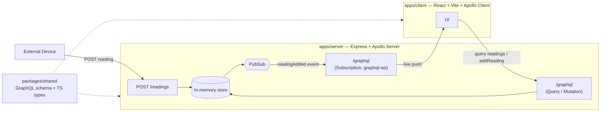

# Greenhouse Monitoring (fullstack-typescript-iot)

A small full-stack TypeScript monorepo for ingesting and viewing greenhouse
sensor readings in real time: external devices post readings over plain
REST, the server broadcasts them over a GraphQL subscription, and the React
client updates live.

## Architecture



## Tech stack

- **Bun workspaces** — monorepo tooling, package manager, runtime for the server
- **Apollo Server** (Express integration) — GraphQL API
- **graphql-ws** — GraphQL subscriptions over WebSocket
- **React + Vite** — client app
- **Apollo Client** — GraphQL queries/mutations/subscriptions in the browser
- **TypeScript** everywhere, **ESLint** (`typescript-eslint`) for linting

## Project structure

```
apps/
  server/   @iot/server  — Apollo Server + REST ingest endpoint
  client/   @iot/client  — React + Vite + Apollo Client
packages/
  shared/   @iot/shared  — GraphQL schema (typeDefs) + shared TS types
api.http    — sample requests (GraphQL + REST)
```

## Setup

Requires [Bun](https://bun.com) installed locally.

```bash
bun install
```

## Running the dev servers

```bash
bun run dev          # server (:4000) + client (:5173) together
bun run dev:server   # server only
bun run dev:client   # client only
```

Once running:
- GraphQL HTTP endpoint: `http://localhost:4000/graphql`
- GraphQL subscriptions (WebSocket): `ws://localhost:4000/graphql`
- REST ingest endpoint for devices: `http://localhost:4000/readings`
- Client: `http://localhost:5173`

Other useful scripts (run from the repo root, fan out to every workspace):

```bash
bun run typecheck
bun run lint
bun run lint:fix
bun run build
```

## Trying it out

The server starts with no readings — post some data first, then watch it
appear live in the client.

### Option A: the `api.http` file

Open [`api.http`](./api.http) with the [REST Client](https://marketplace.visualstudio.com/items?itemName=humao.rest-client)
VS Code extension and click "Send Request" above any block. It includes:
- a GraphQL query to fetch readings
- a GraphQL mutation to add a reading
- REST `POST /readings` examples for temperature, humidity, soil moisture and CO2
- an invalid payload example that should 400

### Option B: curl

```bash
curl -X POST http://localhost:4000/readings \
  -H 'Content-Type: application/json' \
  -d '{"metric": "temperature", "value": 23.6, "unit": "celsius"}'
```

### Option C: any GraphQL client

Point a tool like Insomnia, Altair, or Apollo Sandbox at
`http://localhost:4000/graphql` (queries/mutations) and
`ws://localhost:4000/graphql` (subscriptions) — there's no built-in GraphQL
Playground UI on this server, since it's mounted via `expressMiddleware`
without a landing page plugin.

With the client open in a browser, any reading posted through the endpoints
above shows up immediately via the `readingAdded` subscription.
